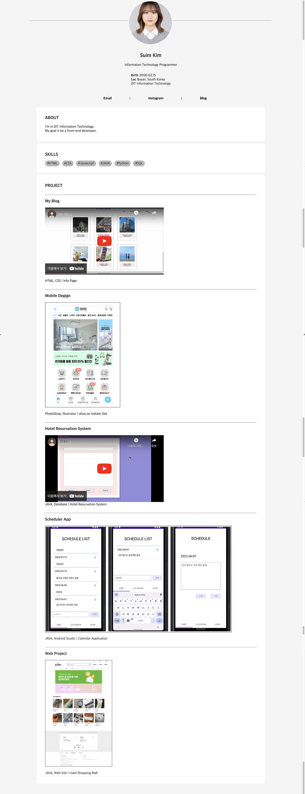

# 이력서(자기소개) 웹사이트 제작

   
  
   

 

## 프로젝트 소개

  이력서를 자기소개 페이지 형식으로 제작해보았습니다. 
  주요 정보나 타이틀은 css의 text-weight 속성을 bold로 적용하여 잘 보이도록 했습니다. 
  연락처 / 개인 블로그 링크는 ul-li로 작성하였고 리스트 스타일은 없애고 수평 정렬 되도록 하여 메뉴바로 작성했습니다. 
   
  
  1. About: 자기소개 멘트를 넣었습니다. 
  2. Skills: 제가 사용할 수 있는 언어목록입니다. 
  3. Project: 제가 그동안 진행 / 완료한 프로젝트 목록입니다.

 

## 디렉토리 구조

  
  + **/img**: 웹 페이지에 사용된 이미지 파일이 들어있습니다.

 

## 사용 언어 및 프로그램

|    HTML    |     CSS    |   vscode   | 
| :--------: | :--------: | :--------: | 

 

## 배운 점 & 아쉬운 점

   1학년 1학기 과제로 비슷한 형식의 페이지를 제작해 본 적이 있습니다. 그 때는 pc 화면으로만 제작하여서 모바일에서는 css 속성 등이 다 깨져보였었는데 이 페이지는 모바일에서도 깨지지 않게 제작되었습니다. 웹 페이지 작성은 가장 자신있는 전공 중 하나였습니다. 그러나 이전의 저의 웹 페이지 결과물은 다양한 디바이스 화면 크기를 고려하지 않고 제작했었습니다. 이번에 다시 한 번 HTML과 CSS를 복습하고 화면크기에 따라 반응하는 웹 페이지를 만들 수 있게 되면서 앞으로 더 나은 반응형 웹 페이지를 만들 수 있게 된 것 같습니다. 

   
  더불어 이 웹 페이지에는 Javascript가 사용되지 않았는데 다시 수정을 해서 보완할 때는 Javascript를 활용하여 더 완성도 있는 페이지로 만들고 싶습니다.

 

## License

  MIT &copy; [SUIM](mailto:suim0215@gmail.com)

